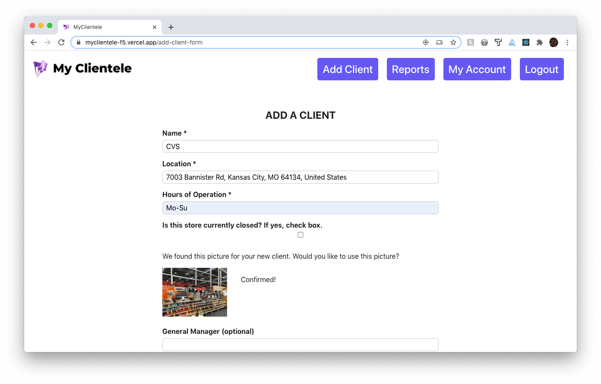

## My Clientele - client

This REACT app allows you to access your daily schedule, clients, previous reports, and even take reports on the go, maximizing your daily productivity.  

With My Clientele, you can keep all your client information in one place. This includes names, locations, hours of operations, if they are currently closed, and the current general manager.  You can even update the clients as this information changes.

Also included is your daily schedule of clients, and the ability to see all of your reports. These reports can be filtered, and feature the date of your report, your notes, and pictures you have taken.

The Take Report feature allows you to seamlessly and effortlessly take notes for each client visit, along with any photos you may need.

My Clientele is ideal for the fast paced and busy lifestyle you lead, and allows you to keep up-to-date with what places are closed due to things like Covid-19 or rennovations with the currently closed feature. With a click of a button, you can keep up to date with your clients and their needs, all from one easy to use app!

### Live Link and Demo Account

The live site can be accessed at [https://myclientele-f5.vercel.app/](https://myclientele-f5.vercel.app/)

To try the service, please use the credentials below to log in

Username: User 
Password: Password12#

### Screenshots

## Server

This app is meant to run with [https://github.com/thinkful-ei-orka/myclientele-f5-api.git] (MyClientele API) server.

Please look at the README.md for more information on utilizing the server.

### To Use With Server

Please update the API_ENDPOINT in the config.js to point to where your server is running.

You will need a TOKEN_KEY to access the MyClietele API server, which should be kept secret.

## Server Documentation

PUT THE API DOCUMENTATION HERE

## Tech Stack

REACT, JavaScript, CSS3, HTML5, SCSS, NodeJS, ExpressJS, PostgreSQL

## To Run A Clean Start 

1. Clone this repository to your local machine
2. cd into the cloned repository
3. Remove the git history with rm -rf .get && git init
4. Install dependencies with npm install
5. Move the example Environment file to .env that will be ignored by git and read by React with mv example.env .env
6. Change project name in package.json to use whatever name you've given this project instead of "name": "myclientele-client"

## Available Scripts

In the project directory, you can run:

### `npm run start`

Runs the app in the development mode. 
Open [http://localhost:3000](http://localhost:3000) to view it in the browser.

The page will reload if you make edits. 
You will also see any lint errors in the console.

### `npm run test`

Launches the test runner in the interactive watch mode. 
Results of the test will be available in the terminal it was initiated in.
Testing smoke and screen testing.

### `npm run build`

Builds the app for production to the `build` folder. 
It correctly bundles React in production mode and optimizes the build for the best performance.

The build is minified and the filenames include the hashes. 
Your app is ready to be deployed!

### `npm deploy`

Deploys app to vercel.

Before this, predeploy runs the build, which gets tested before it is built.

Running deploy will test, build, and deploy the app to vercel.

### `npm run eject`

**Note: this is a one-way operation. Once you `eject`, you can’t go back!**

This command will remove the single build dependency from your project.

Instead, it will copy all the configuration files and the transitive dependencies (webpack, Babel, ESLint, etc) right into your project so you have full control over them. All of the commands except `eject` will still work, but they will point to the copied scripts so you can tweak them. At this point you’re on your own.

You don’t have to ever use `eject`. The curated feature set is suitable for small and middle deployments, and you shouldn’t feel obligated to use this feature. However we understand that this tool wouldn’t be useful if you couldn’t customize it when you are ready for it.
